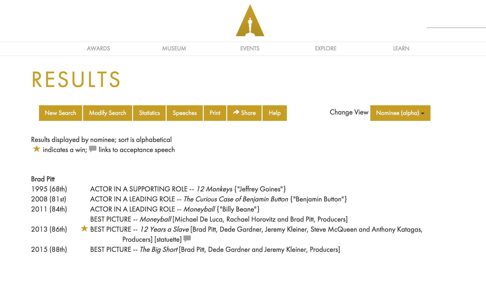

# Academy Awards Database Scraping

There doesn't appear to be a reliable or comprehensive, normalized source for the Academy Awards. However, there the Academy does have a comprehensive searchable database at:

http://awardsdatabase.oscars.org/search/

Example results when searching for the 2016 Academy Award winners and nominees:

This repo contains raw HTML, code (soon), and resulting data (hopefully). It turns out winning Oscars -- or at least how and *to whom* awards are awarded -- is more complicated than anticipated.

Here's some wrong assumptions you/I have about Oscar data:

- The Academy keeps the same categories it had since the beginning (there's no longer awards for Assistant Director or Dance Direction)
- The Academy doesn't add categories (Animated Short Film has existed since the 1930s, but Animated Feature Film began in 2001)
- There are 5 categories for the "Big 5" Oscars (there are 6 -- there are 2 kinds of best screenplay) 
- There has always been a "Best Picture" Oscar (it has undergone at least 5 different name changes, including "Outstanding Picture" and "Outstanding Production")
- There's only one person per nomination (Best Picture, among many other awards, can include many people)
- There's only one person per category (back when there were fewer movies, such as 1928, actors could be nominated for several films)
- There's always been the same number of nominees (Best Picture has recently expanded to include 10 nominees instead of the usual 5)
- There's only one winner per category (nope, there can be multiple winners in the event of a tie, such as the 1932 Best Actor category)
- No two award-winners have ever had the same first and last name (there's Will Smith, the best actor nominee, and William Craig Smith, nominated in 1982 for Art Direction)

## Data notes

To get an idea of how the data is modeled and stored on the Academy's database, do a search at: http://awardsdatabase.oscars.org/search/

Unfortunately, the searches are executed via POST (i.e. state-dependent) requests, using ASP as the backend and some serious JavaScript-heavy front-end code, so direct-links are a little unwieldy. A search for Brad Pitt can be found at this URL:

[http://awardsdatabase.oscars.org/Search/GetResults?query=%7B%22NomineeId%22:6188,%22IsHyperlinkQuery%22:true,%22Sort%22:%221-Nominee-Alpha%22,%22Search%22:%22Basic%22%7D](http://awardsdatabase.oscars.org/Search/GetResults?query=%7B%22NomineeId%22:6188,%22IsHyperlinkQuery%22:true,%22Sort%22:%221-Nominee-Alpha%22,%22Search%22:%22Basic%22%7D)

Here's a screenshot of what that page looks like:

- There's **Brad Pitt**, the person who gets nominated, i.e. `nomineeId=6188`
- Pitt was nominated for the 1995 "ACTOR IN A SUPPORTING ROLE" (`categoryExactId=4` and `&awardShowFrom=68`), for the film, `12 Monkeys` (`filmId=3636`).
- Pitt was one of several producers listed as the 2015 Best Picture award-winning nominee for Best Picture (`nominationId=10453`)

So there's probably at least these tables to be made:

- award_shows
- categories 
  - many-to-many relationship with award shows
  - also, categories vary in name and type over the years)
- nominees 
  - many-to-one relationship with nominations
- films 
  - one-to-one relationship with nominations... I think
- nominations 
  - many-to-one relationship with categories+award_shows
  - many-to-many relationship with nominees
  - one-to-many relationship to films...I think

Other notes:

- The search page filters are quite flexible. You can basically do searches for all the data -- e.g. every nomineee for every category for every year -- and the site will deliver. I've included HTML dumps of these search results in this repo for scraping purposes.
- The search result pages are **massive**, number in the hundreds of thousands of raw HTML (this doesn't include CSS or JS).
- Plenty of typos in the data, including "All about eve" and "Good Fellas"
- The reason why this repo contains 3 separate result pages is because we need to capture the unique ids for the nominees, films, and awards, as well as the **nominations** (which can be a combination of the other 3 datatypes)

## Inventory

### Search result pages

These files consist of *nearly-raw HTML* from the search results at [http://awardsdatabase.oscars.org/search/](http://awardsdatabase.oscars.org/search/). I've removed references to JavaScript files and code, and kept only a subset of the original CSS (including a minimized version of Bootstrap) so that the pages have functionally the same style as the original pages. For web scraping, the actual HTML is all that matters, but it's nice to have HTML files that render legibly in the browser:

- Categories - Results are grouped by category, sorted in chronological result.
  - [Sample webpage](//dannguyen.github.io/awardsdatabase.oscars.org-data-extractor/data/raw/awardsdatabase.oscars.org/sample-categories.html)
  - Raw sample HTML: [data/raw/awardsdatabase.oscars.org/sample-categories.html](data/raw/awardsdatabase.oscars.org/sample-categories.html)
  - Raw full HTML: [data/raw/awardsdatabase.oscars.org/categories.html](data/raw/awardsdatabase.oscars.org/categories.html)
- Films - Results are grouped by film, sorted in alphabetical order.
  - [Sample webpage](//dannguyen.github.io/awardsdatabase.oscars.org-data-extractor/data/raw/awardsdatabase.oscars.org/sample-films.html)
  - Raw sample HTML: [data/raw/awardsdatabase.oscars.org/sample-films.html](data/raw/awardsdatabase.oscars.org/sample-films.html)
  - Raw full HTML: [data/raw/awardsdatabase.oscars.org/films.html](data/raw/awardsdatabase.oscars.org/films.html)

- Nominees - Results are grouped by nominated person, sorted in alphabetical order.
  - [Sample webpage](//dannguyen.github.io/awardsdatabase.oscars.org-data-extractor/data/raw/awardsdatabase.oscars.org/sample-nominees.html)
  - Raw sample HTML: [data/raw/awardsdatabase.oscars.org/sample-nominees.html](data/raw/awardsdatabase.oscars.org/sample-nominees.html)
  - Raw full HTML: [data/raw/awardsdatabase.oscars.org/nominees.html](data/raw/awardsdatabase.oscars.org/nominees.html)

